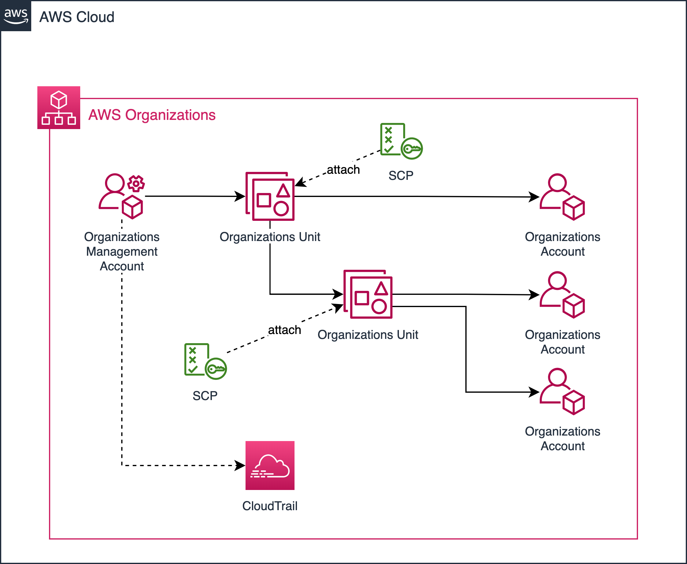

# AWSアカウント管理のベストプラクティス

複数のAWSアカウントを作成/管理する際のベストプラクティスと、アカウント管理ポリシー（定期的な棚卸など）に対する運用コスト削減を検討します。

 

## AWSアカウントを分割するメリット

- PCIDSSへの準拠（[セグメンテーション](https://dev.classmethod.jp/articles/pci-dss-compliance-on-aws/)）
- Webコンソールの分離
- AWSアカウント間においてセキュリティ対策を分離
- コスト管理の観点から顧客に対しサービスプロバイダー型のサービスを提供しやすい

 

## AWSアカウントを分割するデメリット

- アカウントを跨いだ複雑なセキュリティポリシーの管理
- アカウントを跨いだインフラ管理が煩雑
- アカウント間の請求管理

 

## デメリットへの対策

- AWS Organizationsで一元的に管理
- IAMのクロスアカウントアクセスの利用（Switch Role）
- AWS Organizationsで一括請求

 

## AWS Organizations とは

- AD/LDAPでAWSアカウントを管理するイメージ
- root、OU、AWS Account それぞれにポリシー（SCP）を割り当てられる
    - OU間、アカウント間でAWS APIリソースへのアクセス制御（ホワイトリスト、ブラックリスト）
    - 明示的なAllowよりも明示的なDENYが優先される
    - SCPとIAMポリシー両方で許可されたAWSAPIが最終的に利用可能
- 一括請求（Consolidated Billing）でアカウント毎の請求をまとめられる
- CloudTrail、AWS Configなどのセキュリティログをrootアカウントで集中管理
     
    

 

## 設計ポイント

- OUの単位を部署、環境（商用/開発等）で分割するよう設計する（SCPの統一性）
- ログイン用（Switch Role用）のAWSアカウントを決める（IAMユーザの集中管理）
  1. スイッチ先に適切なロールを作成（EC2のみ操作可能など）
  2. スイッチ元にスイッチ先AWSアカウント数分のAssume Role許可ポリシーを作成（管理者用、外注用など）
  3. 適宜IAMユーザへアサイン

 

## 参考
- [AWSにおけるマルチアカウント管理の手法とベストプラクティス](https://d0.awsstatic.com/events/jp/2017/summit/slide/D4T2-2.pdf)
- [AWS Black Belt資料](https://d1.awsstatic.com/webinars/jp/pdf/services/20180214_AWS-Blackbelt-Organizations.pdf)