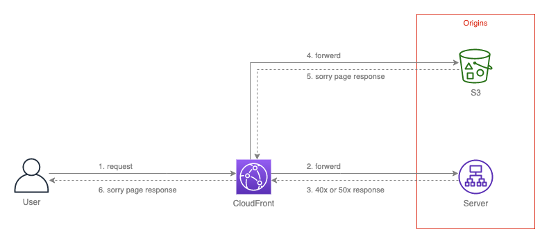
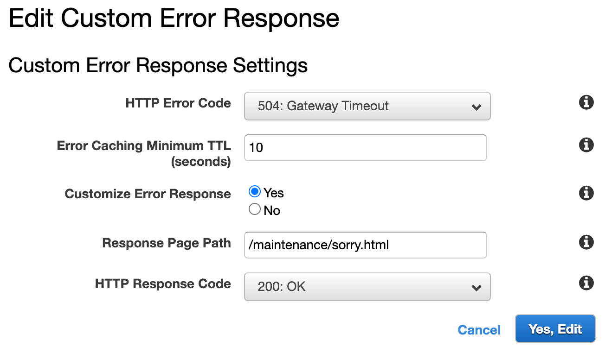

# CloudFrontでエラーページを制御したい

## 目的

CloudFront の Origin (バックエンド) で特定のエラーが発生した場合に、CloudFront でレスポンスコードをキャッチして任意のエラーページを表示したい。

<br>

## 参考

- [AWS CloudFront でカスタムエラーページを返す](https://blog.nijot.com/aws/maintenancewindow-with-cloudfront/)

<br>

## 全体イメージ



<br>

## 手順

ここでは ```バックエンドサーバ = ALB``` の前提で手順を記載する。

<br>

### ベースの設定 (CloudFront)

1. CloudFront へ Distribution を作成

2. ALB と S3 を Origin へ登録

3. Behaviors の Default として ALB を登録

<br>

### エラーページの配置 (S3)

4. S3 へフォルダを作成
    ```
    例）
    maintenance/
    ```

5. フォルダ内へエラーページをアップロード
    ```
    例）
    maintenance/sorry.html
    ```
    注意：JS、CSS、画像等はエラーページ内へ全て埋め込むこと！理由は後半へ記載。

<br>

### エラーレスポンスの設定 (CloudFront)

6. Distribution > Error Pages へ移動

7. エラーコード毎の設定を追加
    例)
    

8. Behaviors へ設定を追加
    - Path Pattern: ```/maintenance/*```
    - Origin: ```S3```

<br>

## 設定上の注意

エラーページのレスポンスは CloudFront 上にて透過的に動作します。
ユーザのブラウザ上ではURLが一切変わりません。

```
例）
https://example.com/contents
↓
500 Internal Server Error
↓
sorry.html を表示
↓
https://example.com/contents
```

その為、エラーページ内へ相対パスでJS、CSS、画像等のコンテンツを記載した場合、バックエンドサーバを参照しようとしてしまいます。

これを回避する為、JS、CSS、画像(Base64)等はエラーページ内へ全て埋め込むように記載します。