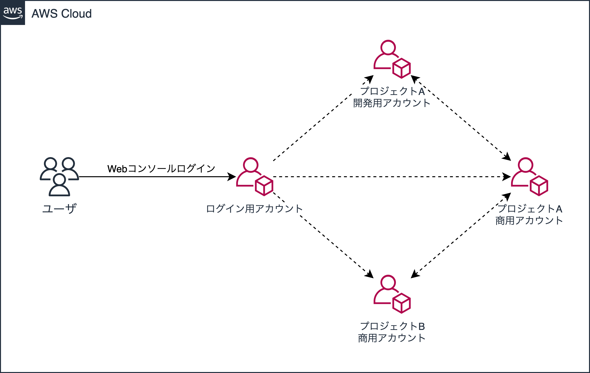

# Switch Roleを利用した複数AWSアカウント管理

Switch Role の簡単な紹介と導入手順について紹介します。

<br>

## 導入のメリット

プロダクト毎だったり環境毎にAWSアカウントを作成している場合のデメリットです。

- アカウント間を跨ぐ運用が非常に面倒（都度ログアウト）
- Credentials をアカウント毎に発行することが億劫（入社/退職者への対応）
- Credentials を開発者に渡すとコード内に埋め込みがち（うっかりPublicへ公開しセキュリティ事故）
  - [GitHub公開後に13分で悪用](https://qiita.com/saitotak/items/813ac6c2057ac64d5fef)

Switch Roleを導入すると上記ストレス/リスクから開放されます。

<br>

## Switch Role とは

Switch Role とは、
- Webコンソールへログインした状態を維持しながら複数のAWSアカウントへスイッチすることが可能
- スイッチ後のIAM権限はスイッチ先の Role に予め設定した Policy が適応される
- 各AWSアカウント上の Cloud Trail にはスイッチ元のアカウント情報が記録される
    <br>
    

<br>

## Switch Roleの設定手順

※注意
以下の手順ではは「AWS管理者が楽をする」ことだけにフォーカスしています。複数の開発者向けに「適切にIAM権限を付与する」という点では、Policy のアサインや Role ARN の展開方法などにまだ課題がありますので、その点は十分に留意して下さい。

<br>

### 前提

利用するAWSサービス
- IAM (Identity Access Management)

普段 Chrome ブラウザを利用している場合には以下の拡張機能を入れておくと便利です。

- [AWS Extend Swith Roles](https://chrome.google.com/webstore/detail/aws-extend-switch-roles/jpmkfafbacpgapdghgdpembnojdlgkdl)

<br>

### ロール作成

1. **スイッチ元** のAWSアカウントIDをメモっておく（数字12桁）
2. Role作成権限を持ったアカウントで **スイッチ先** のWebコンソールへログイン
3. 「IAM」サービスの「ロール」を開く
4. 「ロール作成」を選択
5. 「信頼されたエンティティの種類を選択」で「別のAWSアカウント」を選択
6. 「アカウントID」へ手順(1)でメモったスイッチ元のAWSアカウントIDを入力して次のステップへ
7. アタッチポリシーは管理者なので「AdministratorAccess」を選択して次のステップへ
8. 適当にタグ情報を入力して次のステップへ
9. ロール名と説明を入力しロール作成完了

<br>

### AWS Extend Swith Rolesの設定

10. 手順(9)で作成したロールを検索し詳細内容へ
11. 「ロールARN」の値をメモっておく
12. AWS Extend Swith Roles の configuration へ以下を設定
    ```
    [プロファイル名]
    role_arn = 先ほどメモったロールARN
    region = デフォルトのリージョン
    color = お好きな色を
    ```
    入力例
    ```
    [myaccount-dev]
    role_arn = arn:aws:iam::{ACCOUNTID}:role/{ROLENAME}
    region = ap-northeast-1
    color = 95ea9f
    ```
13. スイッチ元のWebコンソールへログインした状態から、AWS Extend Swith Rolesでアカウントをスイッチ出来たら成功

<br>

> AWS Extend Swith Roles を利用しなくとも Webコンソールの標準機能で Switch Role は可能だが、5アカウント以上を登録すると最初に登録したものから消えていく。

<br>

### 番外編（AWS CLI への設定）

Switch Role 環境下にて各AWSアカウント上の AWS API を叩くためには、Asume Role を利用して一時的な Credencial（STS）を取得する必要があります。AWS CLI を利用している場合、以下のような設定を入れておく必要があります。

```Apache
$ cd ~/.aws
$ vim config

-------------------
[default]
region = ap-northeast-1
output = json

[profile myaccount-dev]
role_arn = arn:aws:iam::{ACCOUNTID}:role/{ROLENAME}
source_profile = default
region = ap-northeast-1
output = json

--snip

-------------------
```

上記設定は、default へ設定されているスイッチ元の Credencial を参照して Assume Role により一時的な権限を取得することを意味しています。AWS API を叩く際は以下のように「--profile」でプロファイル名を指定します。

```Shell
$ aws --profile myaccount-dev s3 ls
```

プログラムからも参照可能です。以下は Python で Boto3 を利用しているケースです。

```Python
import boto3
from boto3.session import Session

session = Session(profile='myaccount-dev')
client = session.client('firehose')

response = client.put_record(
    ...
)
```


<br>

## 参考サイト

- [DevelopersIO - IAMのスイッチロールを理解したい](https://dev.classmethod.jp/articles/iam-switchrole-for-beginner/)
- [DevelopersIO - 初めてのAssumeRole](https://dev.classmethod.jp/articles/sugano-005-s3/)