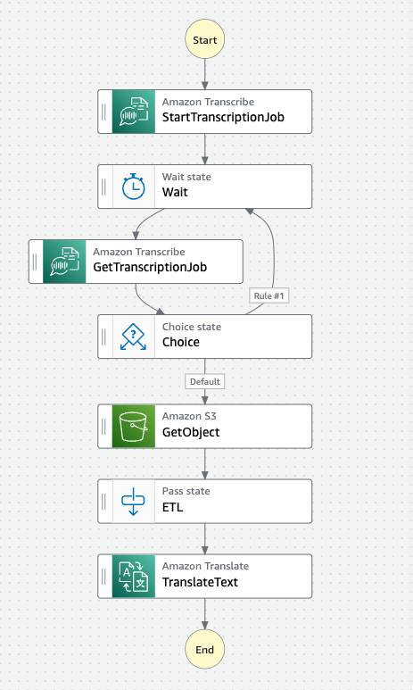

# Step Functions の AWS SDK 統合を検証してみた

## Purpose

Step Functions が AWS SDK のサービス統合により、直接連携可能なサービスが「17 → 200」へ増加したので試してみた。  
尚、本構成では一切 Lambda を利用していません。

<br>

## Stracture

S3 Bucket へアップロードされた動画ファイルを Amazon Transcribe で文字起し、これを Amazon Translate で翻訳してみる。

- Application video  
    [TED Talk: セバスチャン・スラン「Googleの自動運転車で目指していること」](https://www.ted.com/talks/sebastian_thrun_google_s_driverless_car?language=ja)

- State machine  
    

<br>

## Tips

Getting ready...

<br>

## State Machine Code

```json
{
  "Comment": "A description of my state machine",
  "StartAt": "StartTranscriptionJob",
  "States": {
    "StartTranscriptionJob": {
      "Type": "Task",
      "Parameters": {
        "LanguageCode.$": "$.fromLanguege",
        "MediaFormat.$": "$.mediaFormat",
        "Media": {
          "MediaFileUri.$": "$.mediaFile"
        },
        "OutputBucketName.$": "$.s3Bucket",
        "OutputKey": "asr/transcribe.json",
        "TranscriptionJobName.$": "$$.Execution.Name"
      },
      "Resource": "arn:aws:states:::aws-sdk:transcribe:startTranscriptionJob",
      "Next": "Wait",
      "ResultPath": "$.transcription"
    },
    "Wait": {
      "Type": "Wait",
      "Seconds": 10,
      "Next": "GetTranscriptionJob"
    },
    "GetTranscriptionJob": {
      "Type": "Task",
      "Parameters": {
        "TranscriptionJobName.$": "$.transcription.TranscriptionJob.TranscriptionJobName"
      },
      "Resource": "arn:aws:states:::aws-sdk:transcribe:getTranscriptionJob",
      "Next": "Choice",
      "ResultPath": "$.transcription"
    },
    "Choice": {
      "Type": "Choice",
      "Choices": [
        {
          "Variable": "$.transcription.TranscriptionJob.TranscriptionJobStatus",
          "StringEquals": "IN_PROGRESS",
          "Next": "Wait"
        }
      ],
      "Default": "GetObject"
    },
    "GetObject": {
      "Type": "Task",
      "Parameters": {
        "Bucket.$": "$.s3Bucket",
        "Key": "asr/transcribe.json"
      },
      "Resource": "arn:aws:states:::aws-sdk:s3:getObject",
      "ResultSelector": {
        "filecontent.$": "States.StringToJson($.Body)"
      },
      "ResultPath": "$.transcription",
      "Next": "ETL"
    },
    "ETL": {
      "Type": "Pass",
      "Parameters": {
        "transcript.$": "$.transcription.filecontent.results.transcripts[0].transcript"
      },
      "Next": "TranslateText"
    },
    "TranslateText": {
      "Type": "Task",
      "End": true,
      "Parameters": {
        "SourceLanguageCode": "en",
        "TargetLanguageCode": "ja",
        "Text.$": "$.transcript"
      },
      "Resource": "arn:aws:states:::aws-sdk:translate:translateText",
      "ResultPath": "$.translate"
    }
  }
}
```

<br>

## Input Data

```json
{
    "mediaFile": "s3://tedtalk-translate-s3-bucket/video/2011-sebastian-thrun-009-1200k.mp4",
    "mediaFormat": "mp4",
    "fromLanguege": "en-US",
    "s3Bucket": "tedtalk-translate-s3-bucket"
}
```

<br>

## Reference Sites

- [AWS Step Functions Supports 200 AWS Services To Enable Easier Workflow Automation](https://aws.amazon.com/jp/blogs/aws/now-aws-step-functions-supports-200-aws-services-to-enable-easier-workflow-automation/)
