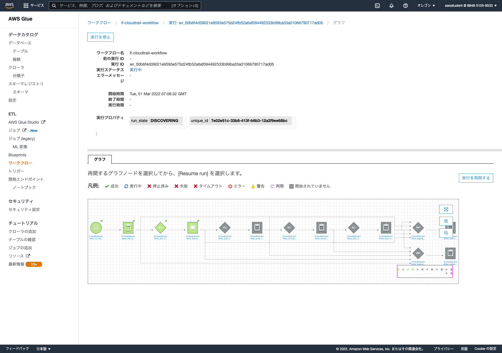

# Building Data Lakes on AWS

概要：有償トレーニング
受講日: 2022/03/01 09:30 - 17:30
場所：WebEX
講義テキスト：eVantage Bookshelf（ライセンスコード: G54G674S8S7HRE8AGUH4）
[Bookshelf](https://evantage.gilmoreglobal.com/#/user/signin)：475/Z83!

<br>

## 1. データレイクの概要

推奨トレーニングコース
- Data Analytics Fundamentals（無料）

参考ブログ
- https://awsvirtual.webex.com/awsvirtual-jp/url.php?frompanel=false&gourl=https%3A%2F%2Faws.amazon.com%2Fjp%2Fblogs%2Fnews%2Fspend-a-day-with-aws-experts-and-learn-to-build-a-data-lake

<br>

## 2. データの取り込み、カタログ化、準備

データレイクの利点
- 部門毎にサイロ化されたデータを横断的に活用
- スケーラブルなインフラ（他システムと連携可能ないくらでも入れられるデータストア）

データ利活用の課題
- データ量、様々なデータ形式などが保存されている（センサーデータ、アクセスログ。。。）
- データが様々なところへ分散されている
- データへの適切なアクセス権限
- カタログ化が必要（どこにどんなデータがどのような形式で存在するのか）

データ活用事例
- [事例①](https://aws.amazon.com/jp/big-data/datalakes-and-analytics/customers/?nc=sn&loc=5&awsf.customer-references-location=location%23japan&awsf.customer-references-segment=*all&awsf.customer-references-industry=*all&awsf.customer-references-use-case=use-case%23data-lakes&awsf.customer-references-tech-category=tech-category%23analytics&awsf.customer-references-product=*all&awsm.page-customer-references-cards=1)
- [事例②](https://aws.amazon.com/jp/blogs/news/analytics-modernization-jireimatsuri-20210624/)

データレイクとデータウェアハウスの違い
- 共通点
    サイロ化されたデータを一元管理

- データウェアハウスの特徴
    構造化されたリレーショナルデータになっている
    事前定義されたスキーマが存在している（型が事前に決まっている）
    ※事前にオールレディなデータが揃ってる環境

- データレイクの特徴
    非構造化されたデータ（rawデータ）
    事前にスキーマが定義されていない

データレイクのコンポーネントとアーキテクチャ（データ分析パイプライン）
1. ストリームでデータを取り込める仕組み（DMS, Kinesis, Snow）
2. いくらでも受け入られるデータストア（※S3, Redshift, RDS）
3. カタログ化＋構造化変換処理（※Glue, EMR）
4. 検索、クエリの実行環境（※Athena, OpenSearch）
5. グラフなどで可視化（※QuickSight）

    ※トレーニングで紹介するサービス

データの価値
```
高  統制されたデータ
↑   クレンジング、変換されたデータ
↑   データ分析に適切なフォーマット済みデータ
低  rawデータ
```

データの取込手段
- トランザクションデータ（to RDS）
    AWS Database Migration Service（無停止で継続的にデータを取り込める）

- ファイルとオブジェクトの取込（to S3）
    AWS Storage Gateway（SMB/NFS/iSCSI接続でGateway化する）
    AWS Snowファミリー

- ストリーミングデータ（to 様々）
    Amazon Kinesis Data Firehose
    ※Big Data on AWSトレーニングで詳しく学べる

AWS Glue
- データカタログ
    AWS Glue データカタログ
    AWS Glue クローラ（クローラ = 地を這う虫）

- サーバレスETL
    AWS Clue ETL

- ビジュアルETLオーサリング
    AWS Glue Studio

データカタログの作り方
- create文で作成する（Athenaから）
- Glue クローラから作成する

Glue クローラが見れるデータソースと分類子
- データソース
    S3, DynamoDB
    Redshift, RDS
    MongoDB, DocumentDB

- 分類子
    avro, orc, parquet, json, bson, xml, カスタム

データのフォーマット、パーティション化、圧縮
- Parquetとは列指向形式のフォーマット（SQLが極速になる）
    列指向だとメモリに読み込まれるデータ量が少なくなる
    行指向だと余計なデータも読み込む必要がある
    分析に有利

- パーティション化
    S3のオブジェクトキープレフィックスに基づいてパーティションを自動的に識別する（西暦、月、日、時間など）

- 圧縮
    ストレージ容量の削減
    読み込み時のI/O削減
    Glue出力の圧縮コーデック（Snappy, LZO, GZIP, 非圧縮）

Handson
- [ハンズオン手順①](./img/snapshot-handson-1.png)

<br>

## 3. データの処理と分析

データセットのマージと結合
- 正規化されたデータを join するのはボトルネックになる

プライベートデータを非公開に保つ
- 適切なマスキング（Glue の ETL 変換ジョブ）

Amazon Macie を使用する
- 機密データを識別して S3 Bucket 毎に解析/一覧化してくれる
- まだ日本語対応していない
- カスタムデータ識別子で個別に辞書登録可能

AWS Clue DataBrew でデータをクレンジングする方法もあるよ
- Workshop 形式の[ハンズオン](https://catalog.us-east-1.prod.workshops.aws/workshops/aaaabcab-5e1e-4bff-b604-781a804763e1/en-US/lab5)がある
- [Black Belt Online Seminar](https://d1.awsstatic.com/webinars/jp/pdf/services/20210217_BlackBelt_GlueDataBrew.pdf)でも資料で紹介

AWS Glue で ETL スクリプトを書く
- Apache Spark
    並列分散処理クラスター環境をサーバレスで提供
    PySpark or Scala をサポート

- Apache Spark Streaming
    ストリーミングデータを逐次処理

- Python シェル
    軽い処理はこちらで十分

ELT スクリプトを書いて Glue ジョブを開発する方法
- AWS Glue スクリプトエディタ
- AWS Glue Studio
    drawio のように碁盤目で処理を繋げていく（Step Functions みたい）
- Jupyter も使えるらしい

AWS Glue DataBrew と AWS Glue Studio の使い分け
- AWS Glue DataBrew: データアナリストとか
- AWS Glue Studio: ETLデベロッパーとか

AWS Glue ジョブの実行（並列/直列でワークフローを作れる）
- スケジューラ
- ジョブトリガー（条件付き）
- オンデマンド

<br>

## 4. AWS Lake Formation を使用したデータレイクの構築

AWS Lake Formation
- データの取込〜カタログ化までの処理を包含するサービス

Handson
- [ハンズオン手順②](./img/snapshot-handson-2.png)
- Lake Formation から Datastore 登録とかしてるけど、結局 Crawler 登録とか ETL ジョブ登録する際には Glue Console へ飛ぶので、Lake Formation の必要性がよく分からない
- CSV から Parquet へ変換して Athena でクエリ実行してみたけど、処理結果的にはそんなに変わらなかった（単純なクエリーだから？）

ドキュメント
- [Lake Formationによるきめ細やかなアクセス制御](https://docs.aws.amazon.com/ja_jp/lake-formation/latest/dg/access-control-fine-grained.html)
- [IAM制御からLake Formation制御へ変更](https://docs.aws.amazon.com/ja_jp/lake-formation/latest/dg/upgrade-glue-lake-formation.html)

<br>

## 5. Lake Formation のその他の設定

ブループリントとワークフロー
- Glue の機能をラップ
- AWSにおけるETL処理のよくあるパターンをテンプレート化

Handson for blueprint
- [ハンズオン手順③](./img/snapshot-handson-3.png)
- ブループリントとワークフローは良い機能（各ETL処理が自動で登録される）


Lake Formation FindMatches を使ってレコード結合
- 重複データなどを機外学習で判断させる
- [チュートリアル](https://docs.aws.amazon.com/ja_jp/glue/latest/dg/machine-learning-transform-tutorial.html)

Amazon QuickSight でデータを可視化
- 超高速並列インメモリ計算エンジン（SPICE）
    一度SPICEへデータをキャッシュして高速集計/可視化
    デフォルトで1GB利用可能
- JavaScript SDK でアプリへ組み込める

AWS QuickSight Q
- データに関する質問に即座に回答
- 自然言語クエリエンジン（文章を読み取ってグラフ化してくれるｗ）
- 現時点で日本語未対応

Handson for QuickSight
- [ハンズオン手順④](./img/snapshot-handson-5.png)
- QuickSight はやっぱりいい
- JIRAとの連携もできるらしい

<br>

## 6. アーキテクチャとコースの復習

CloudFront や ELB のログを可視化すると面白いかも
