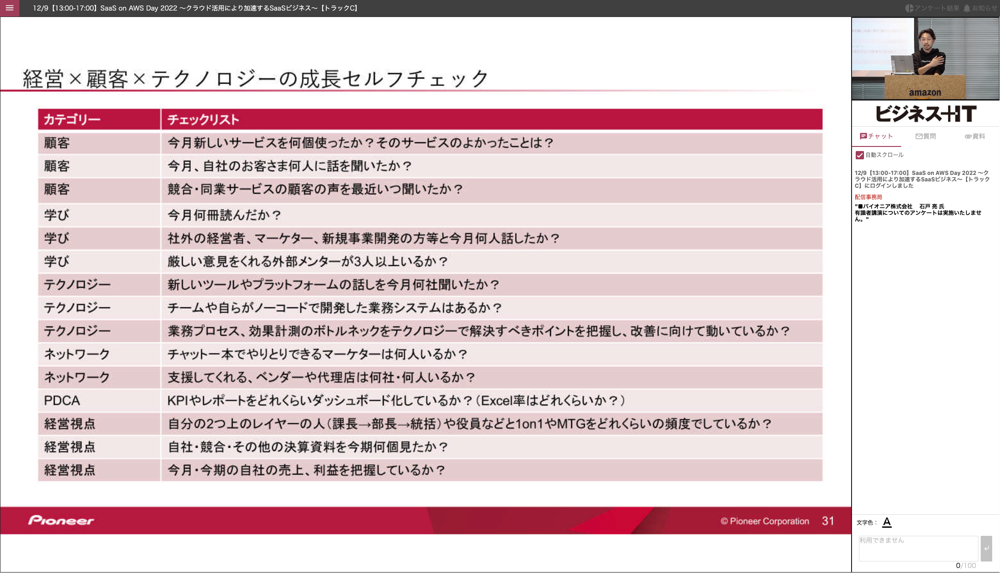
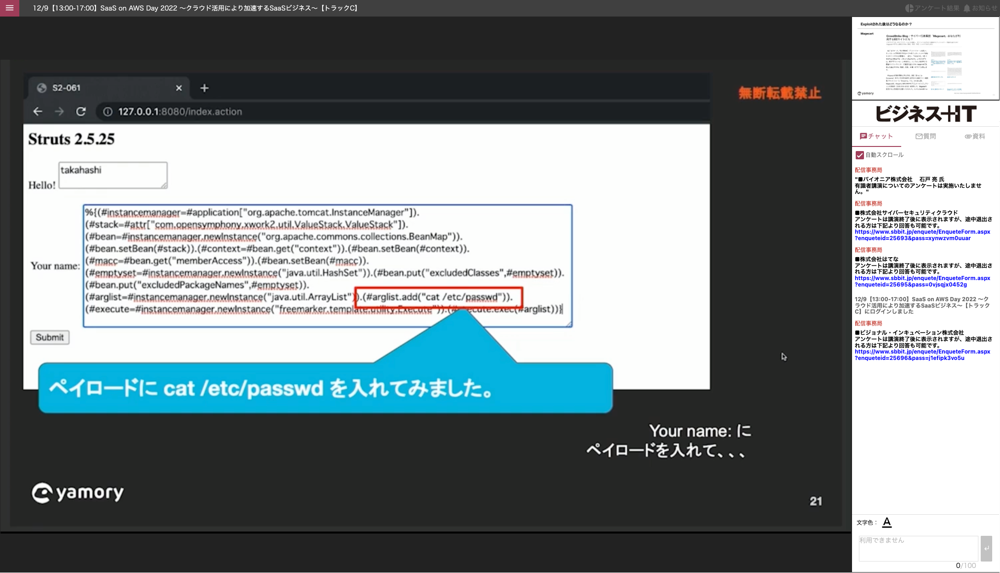
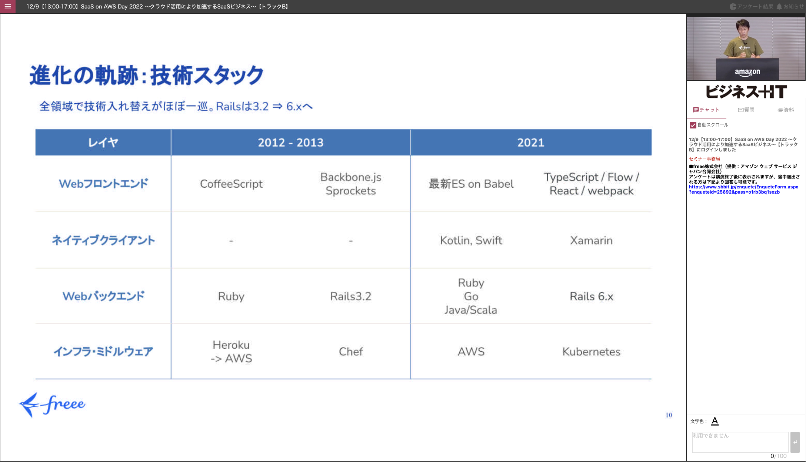

# SaaS on AWS Day 2022 - クラウド活用により加速するSaaSビジネス

日付：2021/12/09

 

## サブスクリプションビジネスへのシフトとSaaS活用の意義（共通）

スピーカー：パイオニア株式会社

キーワード
- マイクロコズム
- テレコズム
- miro

サイバーエージェント時代の経営ｘ顧客ｘテクノロジーの成長セルフチェック

 

## freee PSIRTが語る！AWS＋WafCharmでできるSaaSセキュリティ強化法（Cトラック）

スピーカー：freee株式会社、株式会社サイバーセキュリティクラウド

キーワード
- OODA loop

PSIRT（ピーサート）とは
- 自社で製造・開発する製品やサービスを対象に、セキュリティレベルの向上やインシデント発生時の対応を行う組織
- SREとは異なる

freee PSIRTで取り組んだこと
- 自分達でAWS WAFのシグネチャを書いてた
    - 検知率が低く、検知ミスが多いものと推測される
- WafCharmを導入し検知率が向上した

 

## SaaSビジネスの事業成長を支えるサーバー監視サービスの役割（Cトラック）

スピーカー：株式会社はてな

- 外形監視を入れろ！
    - 大事なのはサーバが動いてるかではなく、サービスが動いてるか
- リソース監視は個別ではなく機能や役割ごとに設定する
- 監視をスキルとして取り組める体制・ツールを利用する
- SLI/SLOを設定して開発チームと運用チームをコラボレーションする
    - mackerelならSLI/SLOをダッシュボード上に可視化可能

 

## 脆弱性への攻撃デモでみるリスクと、効率の良い脆弱性管理とは？！（Cトラック）

スピーカー：ビジョナル・インキュベーション株式会社

キーワード
- トリアージ（傷病者の緊急度、重症度）

VISIONAL
- ビズリーチの子会社
- サービス名：yamory

事例
- Apache Strutsの脆弱性を突かれ機密情報が漏洩
- 賠償で700億円以上の損失
- 実際に攻撃してみた（攻撃手順はGitHubに上がってる）
    

 

## freee の成長を支える AWS（Bトラック）

スピーカー：freee株式会社

- エンジニアは180名ほど
- 課題
    - システムのスケーラビリティ
    - 組織のスケーラビリティ
- サービスインフラとしてのAWS
    - サービスごとにデプロイ方法や構成が異なるので把握するのが大変
    - アプリエンジニアから見てもインフラ構成をキャッチアップするのが大変
- インフラのモダン化・標準化
    - Kubernetesベースでエコシステムにしてく
- DBの負荷対策
    - Aurora for MySQLへの変更
- 分析環境としてのAWS
    - データが増えたので構成を変えた
    - RDS/S3>Grue>Athena>Redshift
- 開発環境としてのAWS
    - EC2上で開発
    - Dockerを使って開発
- 業務環境としてのAWS
    - Amazon Workspacesを使って業務させる（端末はChromebook）
- freeeはみんなが同じ方向を向いて事業を進められるようにカルチャーづくりを推進している
    - 社内向けサイトをサクッと立ち上げる
    - 全体キックオフサイト「フィリスピフェス2022」開催
- freeeを運営してみて思ったこと
    - データの設計しくると一番大変なのでしかっかり設計するのが肝

技術スタック
