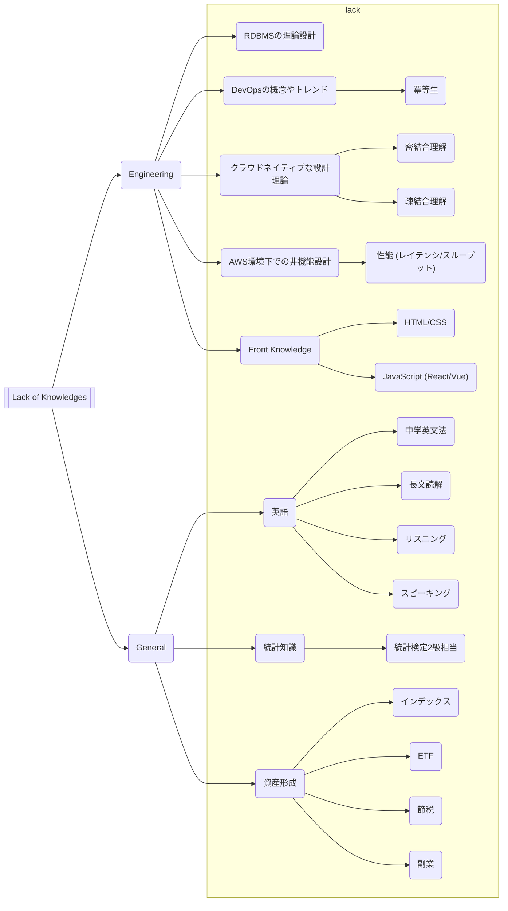

# ゴール設定

## Lack of Knowledge

[![](https://mermaid.ink/img/eyJjb2RlIjoiZmxvd2NoYXJ0IExSXG4gICAgQVtbTGFjayBvZiBLbm93bGVkZ2VzXV0gLS0-IEIoRW5naW5lZXJpbmcpXG4gICAgQSAtLT4gQyhHZW5lcmFsKVxuXG4gICAgQiAtLT4gQjEoUkRCTVPjga7nkIboq5boqK3oqIgpXG4gICAgQiAtLT4gQjIoRGV2T3Bz44Gu5qaC5b-144KE44OI44Os44Oz44OJKVxuICAgIEIgLS0-IEIzKOOCr-ODqeOCpuODieODjeOCpOODhuOCo-ODluOBquioreioiOeQhuirlilcbiAgICBCIC0tPiBCNChBV1PnkrDlooPkuIvjgafjga7pnZ7mqZ_og73oqK3oqIgpXG4gICAgQiAtLT4gQjUoRnJvbnQgS25vd2xlZGdlKVxuICAgIHN1YmdyYXBoIGxhY2tcbiAgICAgICAgQjFcbiAgICAgICAgQjIgLS0-IEIyMSjlhqrnrYnnlJ8pXG4gICAgICAgIEIzIC0tPiBCMzEo5a-G57WQ5ZCI55CG6KejKVxuICAgICAgICBCMyAtLT4gQjMyKOeWjue1kOWQiOeQhuinoylcbiAgICAgICAgQjQgLS0-IEI0MShcIuaAp-iDvSAo44Os44Kk44OG44Oz44K3L-OCueODq-ODvOODl-ODg-ODiClcIilcbiAgICAgICAgQjUgLS0-IEI1MShIVE1ML0NTUylcbiAgICAgICAgQjUgLS0-IEI1MihcIkphdmFTY3JpcHQgKFJlYWN0L1Z1ZSlcIilcbiAgICBlbmRcblxuICAgIEMgLS0-IEMxKOiLseiqnilcbiAgICBDIC0tPiBDMijntbHoqIjnn6XorZgpXG4gICAgQyAtLT4gQzMo6LOH55Sj5b2i5oiQKVxuICAgIHN1YmdyYXBoIGxhY2tcbiAgICAgICAgQzEgLS0-IEMxMSjkuK3lraboi7Hmlofms5UpXG4gICAgICAgIEMxIC0tPiBDMTIo6ZW35paH6Kqt6KejKVxuICAgICAgICBDMSAtLT4gQzEzKOODquOCueODi-ODs-OCsClcbiAgICAgICAgQzEgLS0-IEMxNCjjgrnjg5Tjg7zjgq3jg7PjgrApXG4gICAgICAgIEMyIC0tPiBDMjEo57Wx6KiI5qSc5a6aMue0muebuOW9kylcbiAgICAgICAgQzMgLS0-IEMzMSjjgqTjg7Pjg4fjg4Pjgq_jgrkpXG4gICAgICAgIEMzIC0tPiBDMzIoRVRGKVxuICAgICAgICBDMyAtLT4gQzMzKOevgOeojilcbiAgICAgICAgQzMgLS0-IEMzNCjlia_mpa0pXG4gICAgZW5kIiwibWVybWFpZCI6eyJ0aGVtZSI6ImRlZmF1bHQifSwidXBkYXRlRWRpdG9yIjpmYWxzZX0)](https://mermaid-js.github.io/mermaid-live-editor/#/edit/eyJjb2RlIjoiZmxvd2NoYXJ0IExSXG4gICAgQVtbTGFjayBvZiBLbm93bGVkZ2VzXV0gLS0-IEIoRW5naW5lZXJpbmcpXG4gICAgQSAtLT4gQyhHZW5lcmFsKVxuXG4gICAgQiAtLT4gQjEoUkRCTVPjga7nkIboq5boqK3oqIgpXG4gICAgQiAtLT4gQjIoRGV2T3Bz44Gu5qaC5b-144KE44OI44Os44Oz44OJKVxuICAgIEIgLS0-IEIzKOOCr-ODqeOCpuODieODjeOCpOODhuOCo-ODluOBquioreioiOeQhuirlilcbiAgICBCIC0tPiBCNChBV1PnkrDlooPkuIvjgafjga7pnZ7mqZ_og73oqK3oqIgpXG4gICAgQiAtLT4gQjUoRnJvbnQgS25vd2xlZGdlKVxuICAgIHN1YmdyYXBoIGxhY2tcbiAgICAgICAgQjFcbiAgICAgICAgQjIgLS0-IEIyMSjlhqrnrYnnlJ8pXG4gICAgICAgIEIzIC0tPiBCMzEo5a-G57WQ5ZCI55CG6KejKVxuICAgICAgICBCMyAtLT4gQjMyKOeWjue1kOWQiOeQhuinoylcbiAgICAgICAgQjQgLS0-IEI0MShcIuaAp-iDvSAo44Os44Kk44OG44Oz44K3L-OCueODq-ODvOODl-ODg-ODiClcIilcbiAgICAgICAgQjUgLS0-IEI1MShIVE1ML0NTUylcbiAgICAgICAgQjUgLS0-IEI1MihcIkphdmFTY3JpcHQgKFJlYWN0L1Z1ZSlcIilcbiAgICBlbmRcblxuICAgIEMgLS0-IEMxKOiLseiqnilcbiAgICBDIC0tPiBDMijntbHoqIjnn6XorZgpXG4gICAgQyAtLT4gQzMo6LOH55Sj5b2i5oiQKVxuICAgIHN1YmdyYXBoIGxhY2tcbiAgICAgICAgQzEgLS0-IEMxMSjkuK3lraboi7Hmlofms5UpXG4gICAgICAgIEMxIC0tPiBDMTIo6ZW35paH6Kqt6KejKVxuICAgICAgICBDMSAtLT4gQzEzKOODquOCueODi-ODs-OCsClcbiAgICAgICAgQzEgLS0-IEMxNCjjgrnjg5Tjg7zjgq3jg7PjgrApXG4gICAgICAgIEMyIC0tPiBDMjEo57Wx6KiI5qSc5a6aMue0muebuOW9kylcbiAgICAgICAgQzMgLS0-IEMzMSjjgqTjg7Pjg4fjg4Pjgq_jgrkpXG4gICAgICAgIEMzIC0tPiBDMzIoRVRGKVxuICAgICAgICBDMyAtLT4gQzMzKOevgOeojilcbiAgICAgICAgQzMgLS0-IEMzNCjlia_mpa0pXG4gICAgZW5kIiwibWVybWFpZCI6eyJ0aGVtZSI6ImRlZmF1bHQifSwidXBkYXRlRWRpdG9yIjpmYWxzZX0)