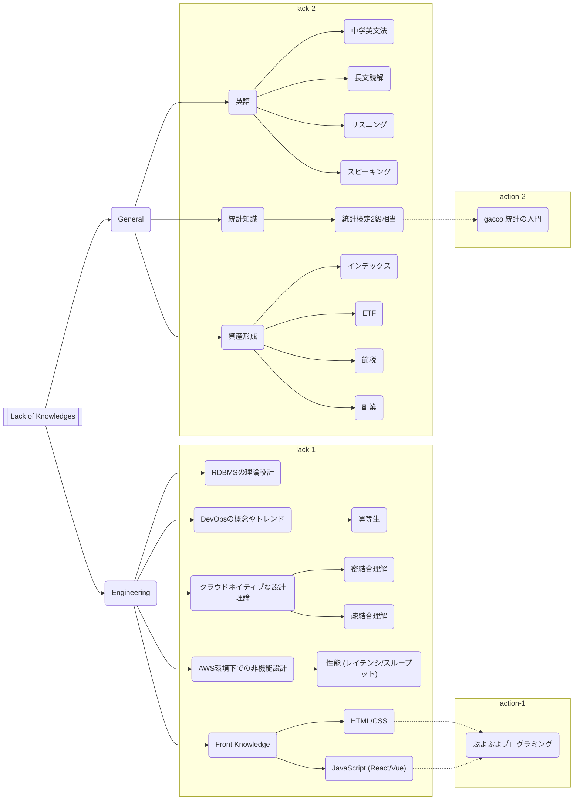

# ゴール設定

## Lack of Knowledge

```mermaid
flowchart LR
    A[[Lack of Knowledges]] --> B(Engineering)
    A --> C(General)

    B --> B1(RDBMSの理論設計)
    B --> B2(DevOpsの概念やトレンド)
    B --> B3(クラウドネイティブな設計理論)
    B --> B4(AWS環境下での非機能設計)
    B --> B5(Front Knowledge)
    subgraph lack-1
        B1
        B2 --> B21(冪等生)
        B3 --> B31(密結合理解)
        B3 --> B32(疎結合理解)
        B4 --> B41("性能 (レイテンシ/スループット)")
        B5 --> B51(HTML/CSS)
        B5 --> B52("JavaScript (React/Vue)")
    end

    subgraph action-1
        B51 -.-> B6(ぷよぷよプログラミング)
        B52 -.-> B6
        click B6 "https://puyo.sega.jp/program_2020/"
    end

    C --> C1(英語)
    C --> C2(統計知識)
    C --> C3(資産形成)
    subgraph lack-2
        C1 --> C11(中学英文法)
        C1 --> C12(長文読解)
        C1 --> C13(リスニング)
        C1 --> C14(スピーキング)
        C2 --> C21(統計検定2級相当)
        C3 --> C31(インデックス)
        C3 --> C32(ETF)
        C3 --> C33(節税)
        C3 --> C34(副業)
    end

    subgraph action-2
        C21 -.-> C4(gacco 統計の入門)
        click C4 "https://gacco.org/"
    end
```

